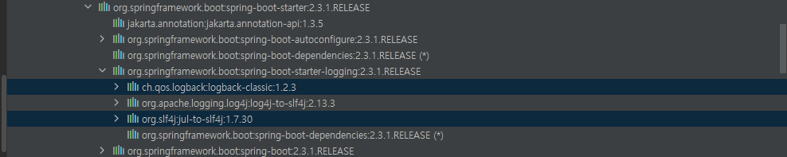

# 스프링-입문-스프링부트
https://www.inflearn.com/course/%EC%8A%A4%ED%94%84%EB%A7%81-%EC%9E%85%EB%AC%B8-%EC%8A%A4%ED%94%84%EB%A7%81%EB%B6%80%ED%8A%B8

# 프로젝트 환경설정
## 프로젝트 생성
 - 인텔리제이의 빌드앤 런을 gradle 에서 intellij로 변경. gradle통해 실행되지 않기때문에 빨리실행됨
 - 

## 라이브러리 살펴보기
*스프링부트라이브러리*
- spring-boot-starter-web
  - spring-boot-stater-tomcat 톰캣(웹서버)
  - spring-webmvc: 스프링 웹 MVC
- spring-boot-starter-thymleaf: 타임리프 템플릿 엔진(View)
- spring-boot-starter(공통): 스프링부트 + 스프링코어 + 로깅
  - spring-boot
    - spring-core
  - spring-boot-starter-logging
    - logback, slf4j
*테스트 라이브러리*
- spring-boot-starter-test
  - junit: 테스트 프레임워크
  - mockito: 목 라이브러리
  - assertj: 테스트 코드를 좀 더 편하게 작성하게 도와주는 라이브러리
  - spring-test : 스프링 통합 테스트 지원

### spring-boot-starter-tomcat 내부에 spring-boot-starter-tomcat 이 존재하여 해당클래스로 웹서버를 구동
### 로깅
 System.out.println 으로 출력하면 안된다. log 파일로 관리해야한다.
 
 
라이브러리가 slf4j, logback 이있다.
요즘에는 slf4j 인터페이스로, 출력은 logback을 사용
스프링 부트에서는 이 두가지를 거의 표준처럼 사용
테스트 junit 이라는 라이브러리를 쓰는데 최근에 5로 넘어가는 추세
mockito,  assertj : 테스트를 편히하게 해주는 라이브러리
spring-test : 스프링과 통합해서 도와주는 라이브러리
 

## View 환경설정
### Welcome page 만들기
`resources/static/index.html`
```html
<!DOCTYPE HTML>
<html>
<head>
 <title>Hello</title>
 <meta http-equiv="Content-Type" content="text/html; charset=UTF-8" />
</head>
<body>
Hello
<a href="/hello">hello</a>
</body>
</html>
```

springboot.io > project > spring boot > learn > 2.3.12 > 찾기 welcome page

- 스프링 부트가 제공하는 Welcome page 기능
  - static/index.html 을 올려두면 Welcome page 기능을 제공한다
  - https://docs.spring.io/spring-boot/docs/2.3.12.RELEASE/reference/html/spring-boot-features.html#boot-features-spring-mvc-welcome-page

`thymeleaf 템플릿 엔진`
- thymeleaf 공식 사이트 : https://www.thymleaf.org/
- 스프링 공식 튜토리얼: https://spring.io/guides/gs/serving-web-content/

- 컨트롤러에서 리턴값으로 문자를 반환하면 뷰 리졸버(viewResolver)가 화면을 찾아서 처리한다.
  - 스프링 부트 템플릿엔진 기본 viewName 매핑
  - `resources:templates.` + {ViewName} + `.html`

 참고 : spring-boot-dev 라이브러리를 추가하면, html 파일을 컴파일만 해주면 서버 재시작없이 view 파일 변경이 가능하다.
 인텔리J 컴파일 방법 메뉴 build -> Recompile
 
```sh 
> ./graldw clean build
> cd build/libs
> java -jar hello-spring-0.0.1-SNAPSHOT.jar
```
실행확인


## 스프링 웹개발 기초
- 정적 컨텐츠
- MVC와 템플릿 엔진
- API : Json 이라는 데이터 구조 포맷으로 client에게 데이터를 전달하는 방식

## 정적컨텐츠
- 스프링 부트 정적 컨텐츠 기능
- https://docs.spring.io/spring-boot/docs/2.3.12.RELEASE/reference/html/spring-boot-features.html#boot-features-spring-mvc-static-content

## MVC와 템플릿 엔진
- MVC: Model, View, Controller
*Controller*
```java
@Controller 
public class HelloController {
    @GetMapping("hello-mvc") 
    public String helloMvc(@RequestParam("name") String name, Model model) {
        model.addAttribute("name", name);
        return "hello-template";
    }
}
```

*View*
`resources/template/hello-template.html`
```html
<html>
<body>
<p th:text=""'hello' + ${name}">hello! empty</p>
</body>
</html>
```

localhost/hello-mvc 를 호출 하면 톰캣은 helloController 에서 hello-mvc 를 찾음
스필ㅇ한테 hello-template viewResolver로 넘김
viewResolver는 template/hello-template.html 똑같은애를 찾아서 Thymeleaf 템플릿 엔진처리해달라고 넘김 


### API
@ResponseBody 문자 반환
```java
public class HelloController {
  @GetMapping("hello-string")
  @ResponseBody
  public String helloString(@RequestParam("name") String name) {
    return "hello " + name;
  }
}
```
- @ResponseBody를 사용하면 뷰 리졸버(viewResolver)를 사용하지 않음
- 대신에 HTTP의 BODY에 문자 내용을 직접 반환(HTML BODY TAG 를 말하는 것이 아님)

실행
- http://localhost:8080/hello-string?name=spring

@ResponseBody 객체 반환
```java
@Controller
public class HelloController {
  @GetMapping("hello-api")
  @ResponseBody
  public Hello helloApi(@RequestParam("name") String name) {
    Hello hello = new Hello();
    hello.setName(name);
    return hello;
  }
  static class Hello {
    private String name;
    public String getName() {
      return name;
    }
    public void setName(String name) {
      this.name = name;
    }
  }
}
```
- @ResponseBody를 사용하고, 객체를 반환하면 객체가 JSON 으로 변환됨

`@ReponseBody`를 사용
- HTTP의 BODY 에 문자 내용을 직접반환
- `viewResolver` 대신에 `HttpMessageConverter` 가 동작
- 기본 문자처리: `StringHttpMessageConverter`
- 기본 객체처리: `MappingJackson2HttpMessageConverter`
- byte 처리 등등 기타 여러 HttpMessageConverter가 기본으로 등록되어 있음

```html
jsonconverter Stringconverter
```
> 참고: 클라이언트의 HTTP Accept 헤더와 서버의 컨트롤러 반환 타입 정보 둘을 조합해서 `HttpMessageConverter` 가 선택된다. 더 자세한 내요은 스프링 MVC 강의에서 설명하겠다.

jackson, gson

- 컨트롤러 : 웹 MVC의 컨트롤러 역할
- 서비스 : 핵심 비즈니스 로직 구현
- 리파지토리: 데이터베이스에 접근, 도메인 객체를 DB에 저장하고 관리
- 도메인 비즈니스 도메인 객체 예) 회원, 주문 쿠폰 등등 주로 데이터베이스에 저장하고 관리됨


회원관리 예제부터 보기 시작하면됨.